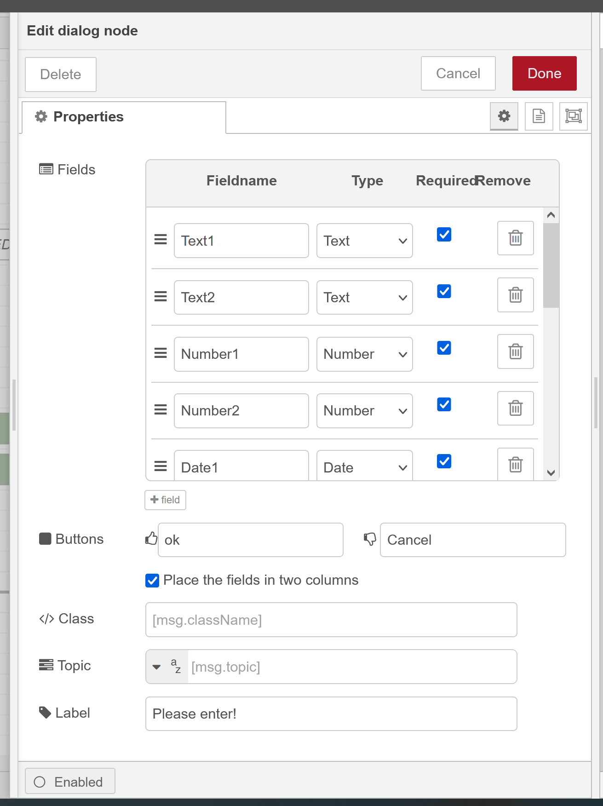
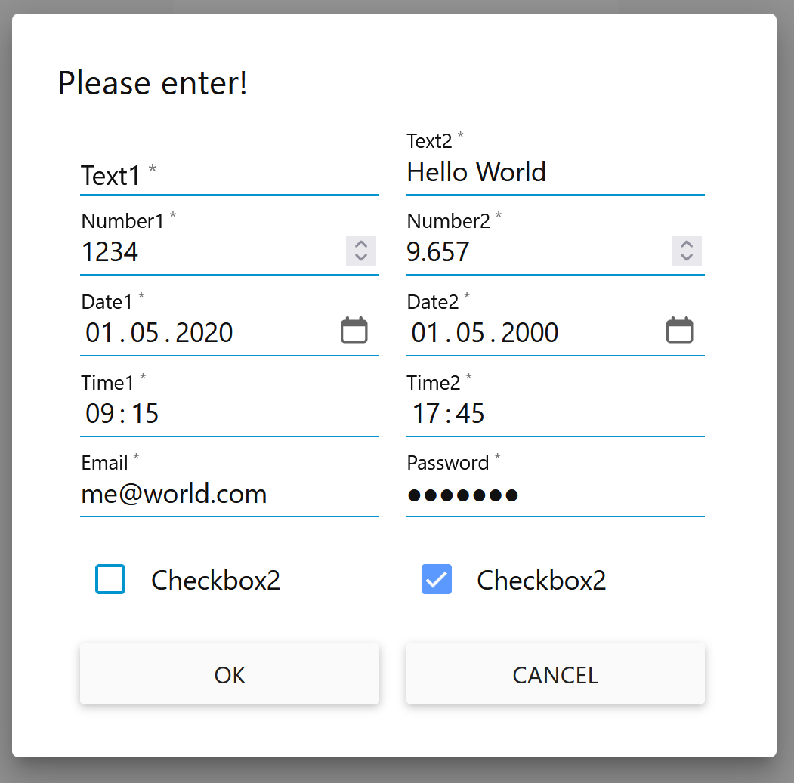

# Node-RED-Dashboard Input Dialog Popup

## Overview

To create an input popup dialog  with several fields of types like:  `text`, `number`, `date`, `time`, `checkbox`, `email` and `password`  placed in one or two rows

The fields could be marked as `required`, which leads to validation checks before the popup dialog is closed.

The enhancements for the Input Dialog Popup are devided into enhancements of the node-red-dashboard main.js file and into an own node named:  node-red-contrib-multi-input-dialog

The Dialog Setup  and the Dialog Popup looks like:

|                              |                      |

### Input Dialog

